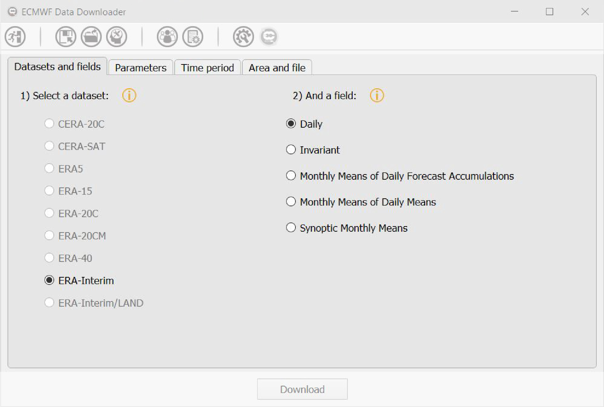

===========
Description
===========

*********************
Important information
*********************

In the following tutorial, all pictures and all commands have been captured on a Windows 10 system.

*******************************
Exploring ECMWF Data Downloader
*******************************

The simplest way to start working with EDD (ECMWF Data Downloader) is to run it by double-clicking on the executable once the software has been downloaded and installed.

EDD is easy to use and self explaining by the presence of information buttons (once a button is clicked, a popup appears with text to explain the purpose of the area actually used) and tool tips. It is composed of different windows, designed to display information to the user and accept interactions.

-----------------------
Current GUI limitations
-----------------------

Actually, the GUI has few limitations based on the fact that the software doesn't include any database or any links to the ECMWF database. The interactions betweens the different objects of the main window and how the tabs behave between them is purely based on the assumptions of the developer. Thus it could lead to the rejection of queries by the ECMWF web API because queries can contain errors. In that case, a window which handle raw inputs has been included for expert users.

---------------
The main window
---------------

The main window of the GUI (cf. :numref:`edd_mainwindow`) is what the user sees once he launches the software.

   
   The main window in EDD.

The main window is composed of three parts, from up to down:

* the first one (from 1 to 7) is a toolbar containing 7 icons and giving access to different kind of functions and windows:

  1. the Exit icon is used to exit the software.
  2. the Save icon is used to save a query in an XML file.
  3. the Open icon is used to open an XML file and load a query written inside.
  4. the Expert icon displays a window where a user can prepare a query based on the keywords used by ECMWF for the web API.
  5. the About icon displays a window whith information about EDD and the changelog.
  6. the Options icon displays a window containing all options of EDD. The user can change all options from here.
  7. the Update icon is only enabled when an update for EDD is available. By clicking on it, a user will launch the automatic update procedure.

* the second one (8) is a central widget whose purpose is to let the user to prepare a query based on its choices in the GUI.
* the last one (9) is a simple button, used to validate the choices of the user and to send the query to ECMWF web API.

------------------
The central widget
------------------

The central widget is composed of four tabs. The first tab (cf. :numref:`edd_mainwindow_tab1`), called Datasets and fields, is dedicated to the dataset and the class/field in the dataset. Actually, only ERA Interim is included in the software. The user has to select a dataset to populate, automatically, the field part.

   
   The first tab in EDD, with a dataset and a field selected.

The second tab (cf. :numref:`edd_mainwindow_tab2`), called Parameters and populated once the dataset and the field have been selected, displays the list of parameters (or variables) extracted from the dataset and the field chosen by the user. It is possible to select one or multiple parameters. If another dataset and/or another field are selected by the user, the parameters list will be reseted.

   
   The second tab in EDD.

The third tab (cf. :numref:`edd_mainwindow_tab3`), called Time period and enabled once one or more parameters have been selected, displays the different times, steps and time periods that the user can select. Depending on the parameter, the dataset and the field, the times and steps can change and can be available or not for the user. Concerning the time period, it is accessible from two different ways. By selecting a departure date and an arrival date. Or by selecting one or more months/years in a table. The first way is only accessible to daily parameters.

   
   The third tab in EDD, with a yearly time period selected.

The fourth tab (cf. :numref:`edd_mainwindow_tab4`), called Area and file, is enabled once one or more parameters have been selected. It displays the different options to change the resolution and the area of the dataset and field. By default, options are already selected for the area and resolution, based on default option stored on the ECMWF website. From the same tab, it is also possible to indicate a file name and the format for the file. If the user doesn't inform the file name and the file format, defaults are used, output and Grib respectively.

   
   The third tab in EDD, with default options.

   
-------------------
The download button
-------------------

Once the user has made its choices in the different tabs, it is the right time to click on **Download** (cf. :numref:`edd_mainwindow`, 9). Before sending the query to the ECMWF web API, the software executes a checking function to be sure that all mandatory fields have not been forgotten. If an error is discovered, a warning window will appear to inform the user that items in red should be reviewed.
If the checking of all fields is successfull, the request is prepared by the software to comply with the ECMWF web API, and send right away. At the same time, a new window appear and displays messages from the ECMWF web API (cf. :numref:`edd_download`, left), beginning with the connection status and so on. Once the request has been accepted, validated and processed, the download begins (cf. :numref:`edd_download`, right). Depending on the number and complexity of the different requests processed by ECMWF servers, the user request can stay on **queued** a certain amount of time. It is not possible to cancel a request from EDD if it is queued, even if it is possible to close the window. In that case a warning window is displayed (cf. :numref:`edd_download_canceled`) and inform the user what he must do. Actually, the cancellation of a queued request can only be done from the user account. When the download has started, it is possible to cancel the download from EDD.

   
   The download window, left: the user's request queued on ECMWF servers ; right: a file is actually downloaded.

   
   The cancel window, warning the user about the implications of cancelling a request.

   
-----------------
The expert window
-----------------

The Graphical User Interface can be a limitation for those who wants to send a complex query in ECMWF datasets (actually covered or not by EDD). In that case, a kind of expert mode has been included. It is accessible by clicking on the expert icon (cf. :numref:`edd_mainwindow`, 4). A window (cf. :numref:`edd_expertwindow`) appears and gives the possibility to the user to prepare a query based on ECMWF keywords. 15 keywords are available, and if more keywords are needed, the user can enter them in the *other keywords* field in the last tab. Info buttons are here to help the user to understand each keyword, with a link to the complete explanation on the ECMWF website.

There is no mandatory keywords, the user is absolutely free to let all keywords which are not needed for its query empty. Once the query is ready, the user has to click on **Submit** to send the request to ECMWF servers. The download window is then displayed and the ECMWF web API sends back information about the validation of the request.

   
   The expert window, where the user can prepare its query based on ECMWF keywords.

-----------------
The about window
-----------------

The about window (cf. :numref:`edd_about`), accessible by clicking on the about icon (cf. :numref:`edd_mainwindow`, 5), displays information about EDD and the changelog available in the *documentation* folder.

   
   The about window, displaying information about EDD and the changelog.

------------------
The options window
------------------

During the first startup, EDD creates an .ini file where all options are stored. A window (cf. :numref:`edd_optionwindow`) is accessible to the user to change those options through an icon in the main window (cf. :numref:`edd_mainwindow`, 6). Here are the available options:

* logging level (*level* in the .ini file): a specific level can be chose in the combo box.
* Path of the logging file (*path* in the .ini file): the path where to save the log file. If the path doesn't exist, an error message is added to the log file and the path is reseted to the default path.
* API URL (*url* in the .ini file): the URL of the API should be entered here (already embedded by default)
* User key (*key* in the .ini file): a personal key, provided by ECMWF, is required to use the web API. For more information and to obtain your key, please click on the following link:https://software.ecmwf.int/wiki/display/WEBAPI/Access+ECMWF+Public+Datasets#AccessECMWFPublicDatasets-key.
* User email (*email* in the .ini file): the user email address is required to use the web API.
* ECMWF file folder (*folder* in the .ini file): a folder where to save the file/data downloaded on ECMWF servers. EDD check the path at each startup. If the path doesn't exist, an error message is added to the log file and displayed to the user, and the path is reseted to the default path.
* Display ECMWF web API information at startup (*display_api_info* in the .ini file): If checked, ECMWF Data Downloader displays information about the ECMWF web API at startup.
* Check ECMWF Data Downloader updates on GitHub (*check_update* in the .ini file): allows EDD to check for an update online.

   
   The options window, where the user can change EDD options.

   
-----------------
The update system
-----------------

A simple update system has been included in EDD. How it works is based on the Operating System of the user. If EDD detects a new update in the Release tab of its repository on GitHub, the update icon (cf. :numref:`edd_mainwindow`, 7) is enabled. Once the user click on it, a window (cf. :numref:`edd_update`) appears and displays information. It's up to the user to click on **Update** or **Download** to launch the update procedure.

   
   The update window, sources are detected by EDD and the update system proposes a .zip update.

Depending on the Operating System, the update procedure is different:

* on Windows, once the user clicks on **Update**, EDD will download the update (an .msi file), close itself and execute the update file.
* on Linux, once the user clicks on **Update**, EDD will download the update (a .tar.gz file), copy the update script in the OS temp folder, close itself and execute the update script.
* from sources, once the user clicks on **Download**, EDD will download the update (a .zip file). The user has to uncompress and move all files to the EDD folder. 

-------------------
The download system
-------------------

To download data from ECMWF servers, EDD uses a homemade function to connect to the ECMWF web API. Once the user validates its query by clicking on the **Download** button, all fields are inspected by a function to check that all mandatory fields have been well filled in and/or selected. If the result is satisfying, all fields are then sent to another function to translate the user inputs into ECMWF keywords. The query is a dictionary constituted of all those pairs keyword/value. Finally the sending of the query is done by embedding the query dictionary in a request method POST. If received by ECMWF servers, the query is queued a certain amount of time and an answer is sent back by the web API, containing the status code of the answer, the ID of the request and other information like the *retry* parameter. The *retry* parameter is used by EDD to interrogates the ECMWF servers about the status of the query. If the query is still queued or validated and being processed, the answer will be the same, with the same status code (202). If the query is not validated (because a keyword is not recognized, for example), the answer will change with an error message and a status code above 400. Once the query is accepted, validated and processed, the anwser contains a status code equal to 303 and a new link to download the requested file. Following that answer, EDD downloads the file in the directory specified by the user.

The cancelation of a query through EDD is only possible during a download, a request method DELETE is sent to the ECMWF server with the link to the file to tell to the servers that the file can be deleted. The cancelation of a query when it is queued on ECMWF servers is not possible through EDD. Even if the process in EDD can be canceled and closed, the user has to visit its account and the webpage dedicated to its queries (http://apps.ecmwf.int/webmars/joblist/) to cancel a query.

