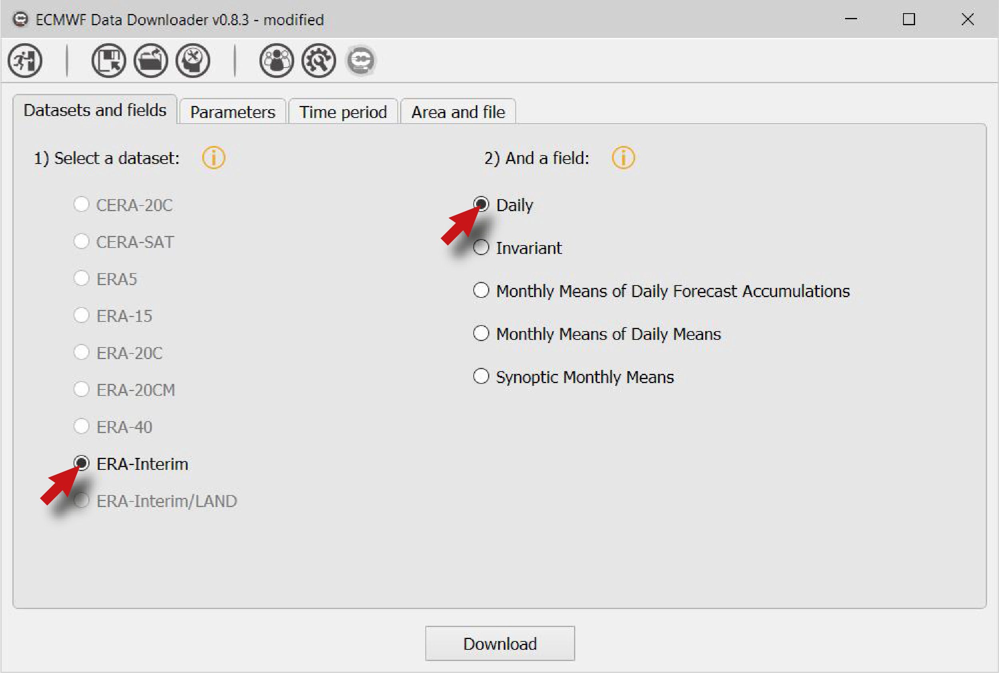
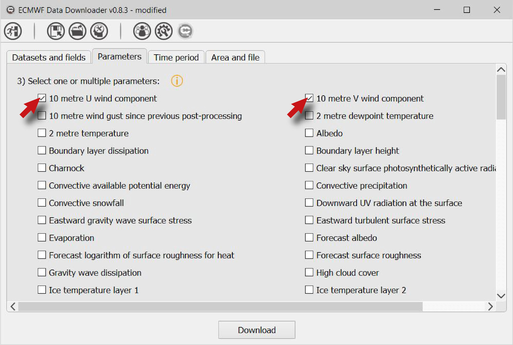
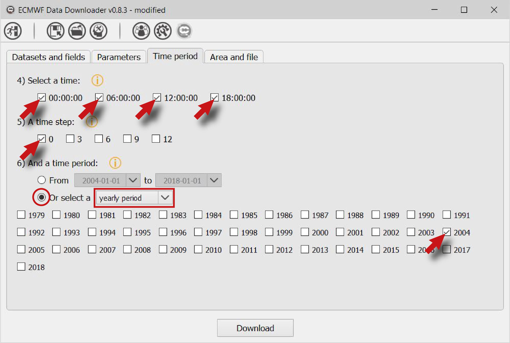
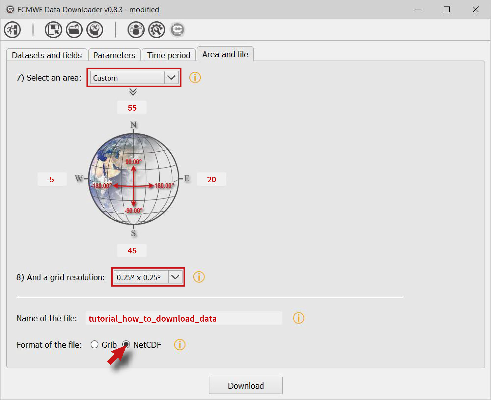
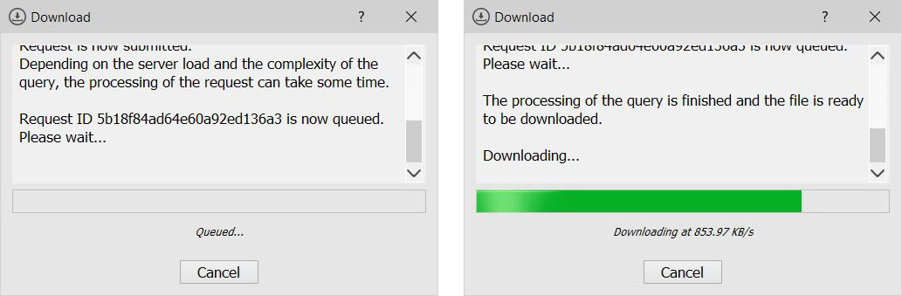
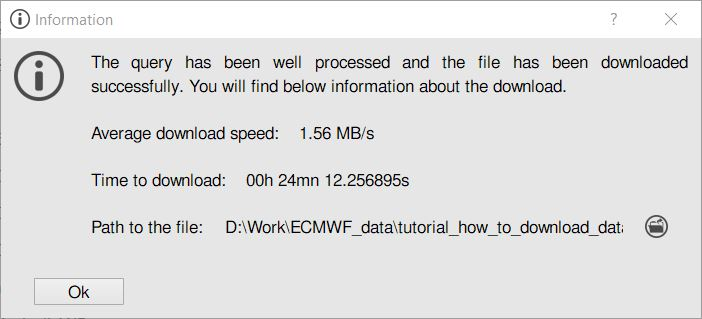

========
Tutorial
========

*********************
Important information
*********************

The tutorial proposed here is produced using the ECMWF Data Downloader 0.8.3 for Windows. It shouldn't differ to what the user can expect from the Linux version or the sources.

*************************************
How to download data ? (from the GUI)
*************************************

* First a dataset has to be selected and then a field.

   
* Select one or more parameters.

   
* And a time (or more), a step (or more) and a period.

   
* Choose an area and a resolution. And finally, choose a name for the file and a file format.

   
* Click on **Download** to send the query. If the query is well received by ECMWF servers, it will be queued. Once the file is ready, EDD downloads it.

   
* Finally, EDD displays a window at the end of the process to confirm that the file have been well downloaded.

